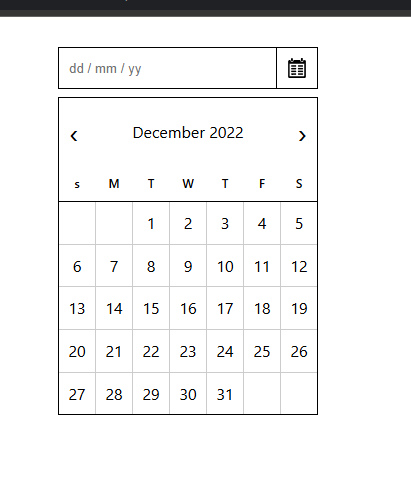

#  Datepicker UI (HTML + CSS Only)

A simple **Datepicker UI component** built using only **HTML and CSS**.  
This project focuses on practicing **layout, positioning, and styling** without JavaScript.

---

##  Preview

---

##  Tech Stack

- HTML5
- CSS3 (Flexbox + Grid)

---

## Project Idea Source

This project is inspired by:

👉 https://roadmap.sh/projects/datepicker-ui

